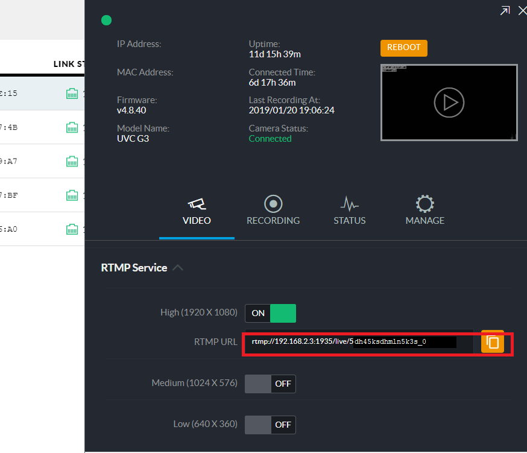
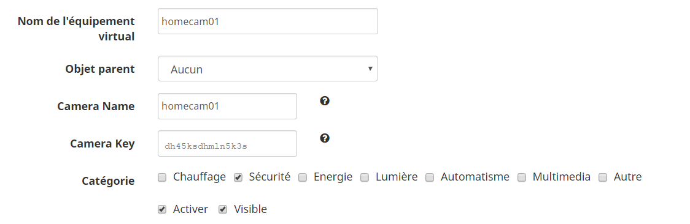
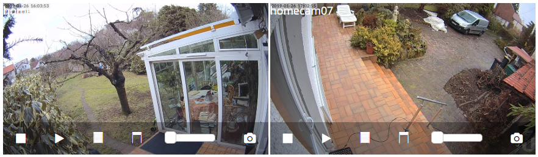
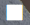
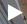
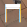
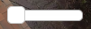
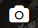

# éunifivideo 

Description
===========

Ce plugin permet l’exploitation des Caméras Ubiquiti au travers du servers unifi video et de son API.
Il permettra de pouvoir gérer les options de privacy et d'enregistrement.

Introduction
============

Pour fonctionner le plugin nécéssite de fonctionner avec le serveur NVR Ubiquiti, il est impossible de communiquer directement avec les caméras au travers du mode StandAlone.

Le scan automatique ne fonctionne que dans le cas de la configuration d'un port sécurité de type SSL.
Si un port non sécurisé (SSL) est utilisé il faudra ajouter manuellement les caméras et toutes les fonctionalités ne seront pas disponibles

> **Tip**
>
> le plugin fonctionne aussi bien en liaison avec un serveur interne qu'avec un serveur externe, une adresse IP ou un FQDN

Attention, pensez à bien définir les filtres de privacy dans l'interface Unifi Video du NVR

Configuration
=============
Après le téléchargement du plugin, vous n'avez plus qu'a l'activer et à remplir les Informations de configurations suivantes :

- Adresse IP du serveur : Est l'adresse IP ou le FQDN de votre serveur (sans http)
- Port du serveur : Port utilisé pour accéder au serveur (Si le port indiqué n'est pas un port sécursé SSL l'autodetection en fonctionnera pas)
- API key : Elle est obtenue dans l'interface d'administration Ubiquiti (voir capture ci dessous

Utilisation
===========

Ajout Automatique des Caméras
-----------------------------
Une fois la configuration effectuée vous pouvez si vous le souhaitez lancer la remontée automatique des caméras.
Pour cela il suffit de cliquer sur :

Quelques secondes plus tard vous devriez voir apparaitre l'ensemble de vos caméras correctement configurées

Ajout Manuel des Caméras
-----------------------------
Pour ajouter une caméra manuellement il va falloi aller récupérer la clé de la caméra dans l'IP
Pour cela ouvrez votre interface unifi video et selectionner la caméra que vous souhaitez manager.
Dans l'onglet vidéo, cherchez la partie RTMP ou RTSP service et activer la si ce n'est pas fait (vous pouvez desactiver ensuite l'option)
Nous allons nous intéresser au champ URL et plus particulière à ce qui se trouve derrière /live/
Nous prendrons donc la chaine en  nous arretant ensuite avant le _ qui se trouve à la fin ce qui dans notre exemple nous donne :
dh45ksdhmln5k3s

Une fois cette information récupérée vous pouvez commencer à créer votre nouvelle caméra en cliquant sur le bouton "Ajouter"

Il ne vous reste plus qu'a compléter les informations de la caméra

- Nom de l'équipement : Nom dans Jeedom
- Objet parent : Objet auqel la caméra est rattachée
- Camera name : Nom de la caméra dans le NVR unifi
- Camera Key : Clé recupérée précédement

Présentation du Widget
----------------------
Le Widget proposé en standard avec les cameras se présente comme suit :

Vous y retrouver la dernière capture d\'écran disponible (l\'ensemble des captures étant sauvegardé dans le repertoire /plugins/unifivideo/captures/{Nom de la Camera}).
A partir de cette interface il est possible :
- d\'arrêter les enregistrements 
- de remettre les enregistrements dans le dernier mode activé 
- d\'activer le filtre de confientialité 
- de désactiver le filtre de confientialité 
- de règler le volume de la caméra 
- de prendre une capture d\'écran 